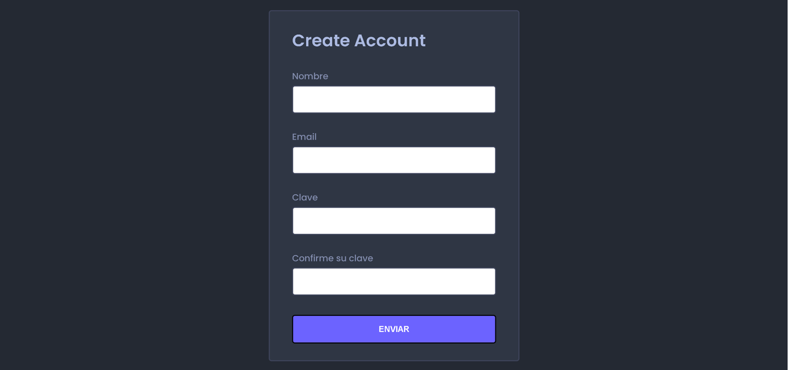
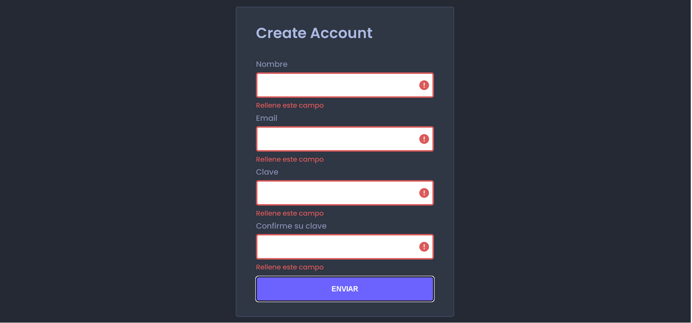
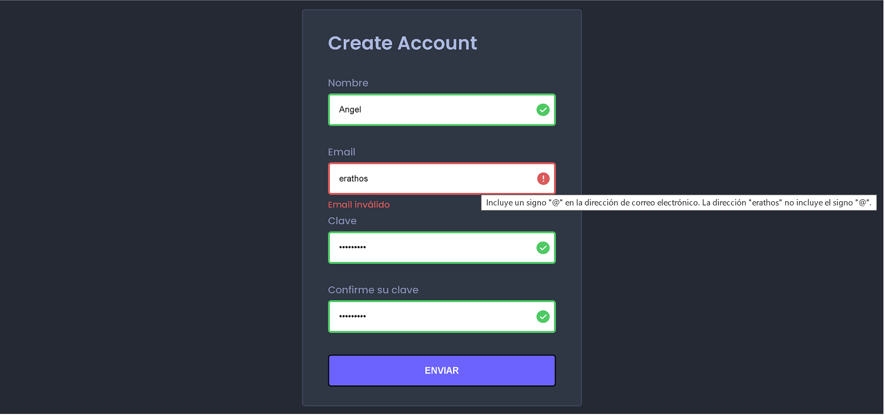
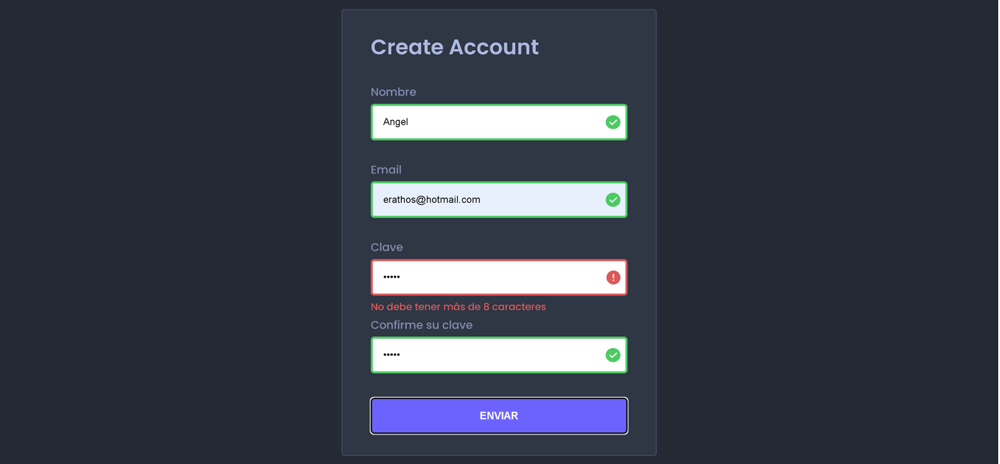
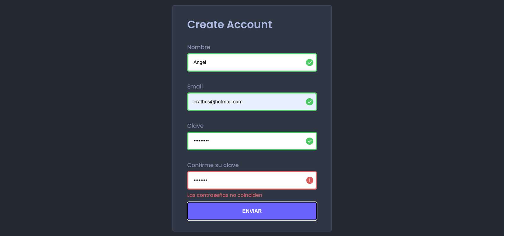

# 💻 Samsung Developer Women 

# 🏛️ Bejob - Camilo Jose Cela University 

## 📜 Front End Development. Level 2. Ed 2022 

### 🎓 Final Lab: Dynamic Form 📝

## 🤵 Mentor

Angel Garcia Lupiañez

## ✍ Instructions

1. Develop a form to create an access account to a website. The form should look like this image:

2. Validations 

- You must use the green color for the correct formats and the red color for the wrong ones.
- All fields are required.

3. Types

- The name field must be text type and can’t contain numbers.
- The email field must be email type. On the other hand, email validation must be done by using Regular Expressions. If the email format is not valid the user will see an error message as follows:

1. Password validations

- The password must have a max length of 8 characters.

- Password's values and Confirm-Password's value must coincide, on the contrary, the following error will be shown:

5. Finally, once all fields have been properly validated, and the user clicks on the submit button, an "Alert" message will inform the user about the successful registration.

### 🛠 Tools

|Tool| Version|
|----|--------|
|HTML|5|
|CSS|3|
|JS| ES6|

### 🔑 License

- [MIT License](LICENSE)

## ⭐ Thanks Team and Mentors 🏅